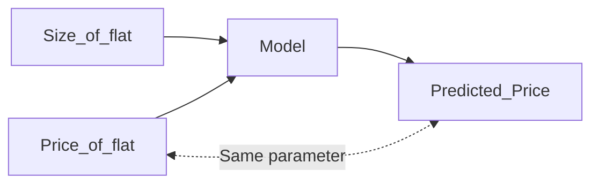
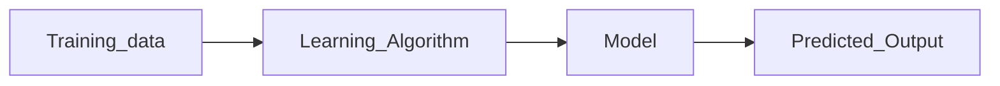

# Linear Regression


#### <font color ="red"> What is the difference between Regression and Classification? </font>

<font color = "green">Answer - </font> 
- <ins>Regression</ins> is used to predict output as <ins>Numerical value</ins>. E.g. if the linear equation is represented as y = m x + C then the predicted value of Y will be found only with Regression. 
- Where as <ins>Classification</ins> is used to predict quantitative values e.g. Less than budget , greater than bugdet or within budget etc. 
classification problems are solved using Logistic regression, Decision tree, Random forest, Deep Neural Networks.


```
Linear regression is supervised learning Model
```
Linear regression model is is given input from known values and is asked to predict output based on the new input. E.g. Predicting price of a flat based on the size of the flat.

|Size(Square Ft)|Price (Cr.)|
|---------------|------------|
|1000|0.70|
1200|0.85|
|1400|1|
1500|1.25|


You know the Output for some Input values and you predict new output for new input.

----------------------------------------------------
|Size(Square Ft)|Price (Cr.)|
|---------------|------------|
|1000|0.70|
1200|0.85|
|1400|1|
1500|1.25|

- <ins>Size</ins> - will be called as Input variable or feature.

- <ins>Price</ins> - will be called as target.


- x = Feature
- y = Target
- m = Total number of training examples
 In the above table m = 4

 Single training example can be represented as (x,y)

 First training example is (1000,0.75)


-----------------------------------------------------------------




```
Linear Regression with one variable is called Univariate regression
```

--------------------------------------------------------

Whole Idea of this exercise is to find out the best suited linear function. 

Effectively our model is 

Parameters of the model
- W is called weight/slope/co-efficient
- b is called bias

#### <font color ="red"> How do we find out w and b for this model? </font>

### COST FUNCTION

First Step to model for parameter (i.e. w and b) is finding cost function. 

```
Cost function basically tell you how well the model  f(x) is doing and what needs to be done to get it better.
```
- Data points are denoted by red cross on the graph 
- Lets say the the best suited line is denoted by green line on the image below.
- Error here will be the difference of Predicted price on the green line to the actual price.


> Problem statement :
> What is THAT value of w and b for which 
>
>