# Linear Regression with single variable

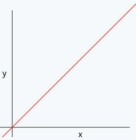

#### <font color ="red"> What is the difference between Regression and Classification? </font>

<font color = "green">Answer - </font> 
- <ins>Regression</ins> is used to predict output as <ins>Numerical value</ins>. E.g. if the linear equation is represented as y = m x + C then the predicted value of Y will be found only with Regression. 
- Where as <ins>Classification</ins> is used to predict quantitative values e.g. Less than budget , greater than bugdet or within budget etc. 
classification problems are solved using Logistic regression, Decision tree, Random forest, Deep Neural Networks.


```
Linear regression is supervised learning Model
```
Linear regression model is is given input from known values and is asked to predict output based on the new input. E.g. Predicting price of a flat based on the size of the flat.

|Size(Square Ft)|Price (Cr.)|
|---------------|------------|
|1000|0.70|
1200|0.85|
|1400|1|
1500|1.25|

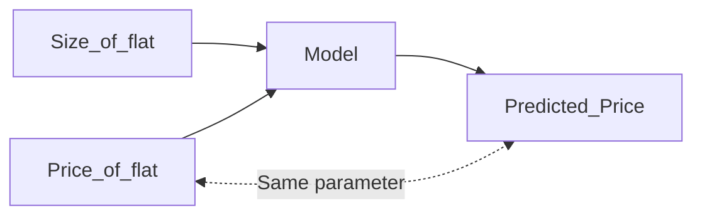
You know the Output for some Input values and you predict new output for new input.

----------------------------------------------------
|Size(Square Ft)|Price (Cr.)|
|---------------|------------|
|1000|0.70|
1200|0.85|
|1400|1|
1500|1.25|

- <ins>Size</ins> - will be called as Input variable or feature.

- <ins>Price</ins> - will be called as target.


- x = Feature
- y = Target
- m = Total number of training examples
 In the above table m = 4

 Single training example can be represented as (x,y)

 First training example is (1000,0.75)

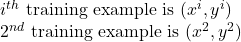

-----------------------------------------------------------------

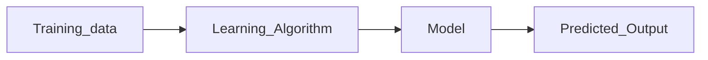
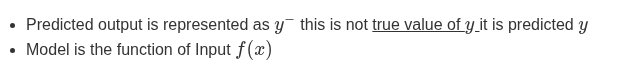

```
Linear Regression with one variable is called Univariate regression
```

--------------------------------------------------------

Whole Idea of this exercise is to find out the best suited linear function. 

Effectively our model is 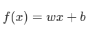

Parameters of the model
- W is called weight/slope/co-efficient
- b is called bias

#### <font color ="red"> How do we find out w and b for this model? </font>

### COST FUNCTION

First Step to model for parameter (i.e. w and b) is finding cost function. 

```
Cost function basically tell you how well the model  f(x) is doing and what needs to be done to get it better.
```
- Data points are denoted by red cross on the graph 
- Lets say the the best suited line is denoted by green line on the image below.
- Error here will be the difference of Predicted price on the green line to the actual price.

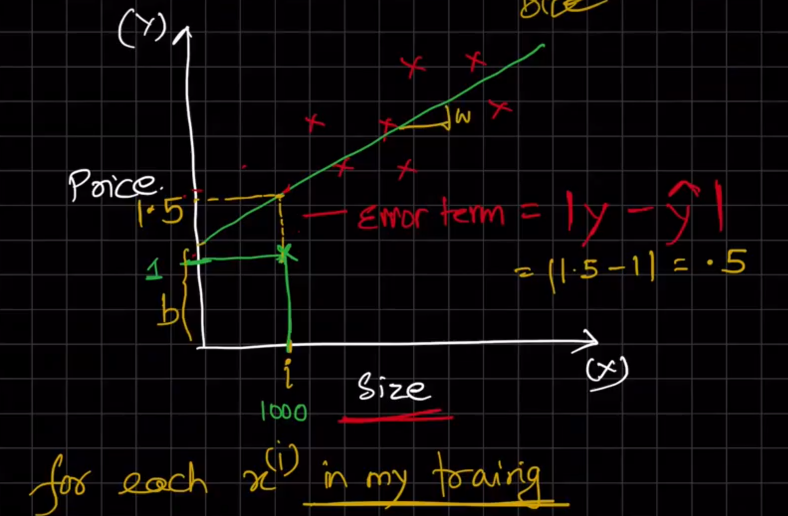

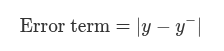

> Problem statement :
> What is THAT value of w and b for which 
>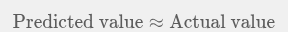
>
>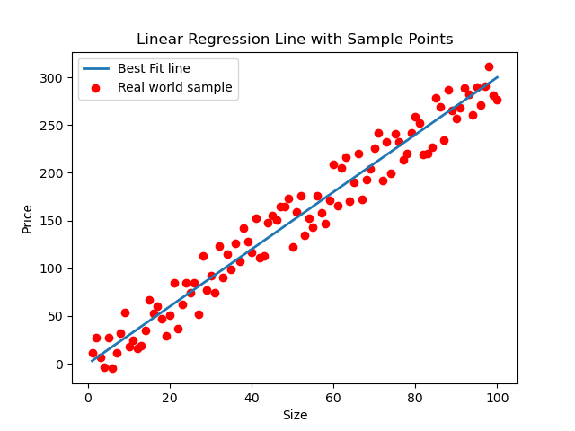
> #### Error is the deviation of predicted line (Best fit line) from the real world sample (red dots)

```
#This is and attempt to implement a simple cost function for linear regression in Python.
import matplotlib.pyplot as plt
import numpy as np
import csv

#reading the red dot coordinates from CSV file
x = []
y = []
with open("red_dot_coordinates.csv", mode="r") as file:
    reader = csv.reader(file)
    next(reader)  # Skip header
    for row in reader:
        x.append(float(row[0]))
        y.append(float(row[1]))
x = np.array(x)
y = np.array(y)
# Initialize parameters
m = 0  # slope
b = 0  # y-intercept
learning_rate = 0.0001
iterations = 1000
n = len(x)  # number of data points
# Cost function
def compute_cost(x, y, m, b):
    total_cost = 0
    for i in range(n):
        total_cost += (y[i] - (m * x[i] + b)) ** 2
    return total_cost / (2 * n)
# Gradient descent
for _ in range(iterations):
    m_gradient = 0
    b_gradient = 0
    for i in range(n):
        m_gradient += -x[i] * (y[i] - (m * x[i] + b))
        b_gradient += -(y[i] - (m * x[i] + b))
    m -= (learning_rate * m_gradient) / n
    b -= (learning_rate * b_gradient) / n
    if _ % 100 == 0:
        cost = compute_cost(x, y, m, b)
        print(f"Iteration {_}: Cost {cost}, m {m}, b {b}")
# Final parameters
print(f"Final parameters: m = {m}, b = {b}")
# Plotting the results
plt.scatter(x, y, color="red", label="Real world sample")
plt.plot(x, m * x + b, color="blue", label="Fitted line")
plt.xlabel("Size")
plt.ylabel("Price")
plt.title("Linear Regression Fit using Gradient Descent")
plt.legend()
plt.show() 
```
Calculating Cost Function
- Step 1 Find all error
- Square the error
- Add all squared error
- take average of all squared error
- Devide by 2 the squared error

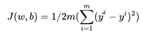

### J(w,b) is the <ins>Cost function</ins>

> 
> For Calculating cost function most easiest way is to assume b = 0

Once for all <font color ="red"> w </font> if <font color ="red">cost function </font> is calculated then plot a graph between Value of the <font color ="red">cost function </font> against the value <font color ="red"> w </font> on whcih it was calcaulated.

> <font color ="red"> w </font> on the x axis
> <font color ="red">cost function </font> on the y axis

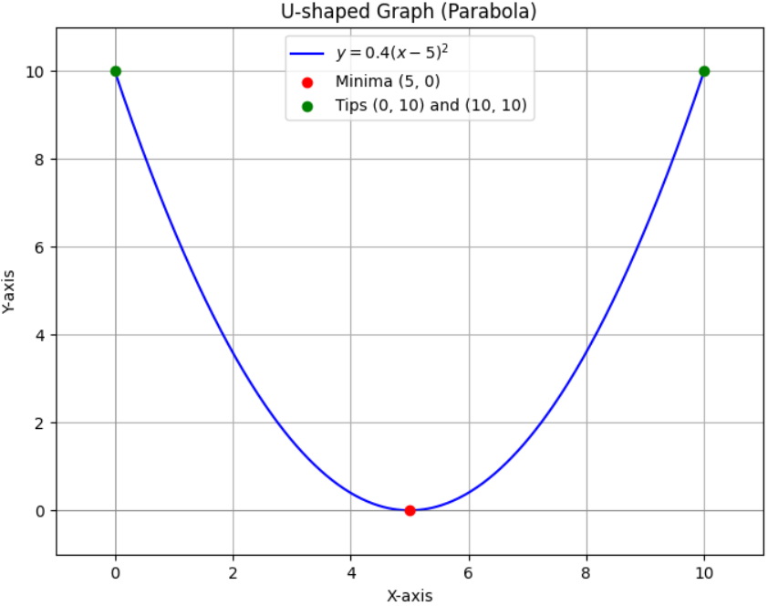

### The <font color ="red"> w </font> where <font color ="red">cost function </font> is minumum will be the <ins>best fit</ins> line.

It will be highly uneconomical to calculate costFunction for all w values. e.g. If you have millions of data it becomes very slow and cumbersome to calcaulate for every w (assuming b is still 0 ). ANd when you take into account also the value of b it further complicates the calculation so what the solution for finding the minima

The solution for this is Gradient Dissent aalgorithm

What is this algorithm? 

Consider you are on a mountain half way and you want to reach the peak. Considering the mountain is foggy and with 0 visibility, how do you find peak then? Best way would be to take small steps in all possible direction and compare your altitude in the altimeter. This will give you answer wether you are gaining elevation or loosing it. and hence you can reach peak. This is what is applied on the graph above to find the minima and best fit w, and b


In the equation above alpha (α) is called he learning rate.
> The value of alpha (α) will be (+)ve value between 0 and 1.

- [ ] Read about Vectorisation and broadcasting algorithm
- [ ] Read about convergence.


Reference material 

- Cousera Mathematics for ML
- StandFord Basics of ML
- Book Fundamentals of ML 

